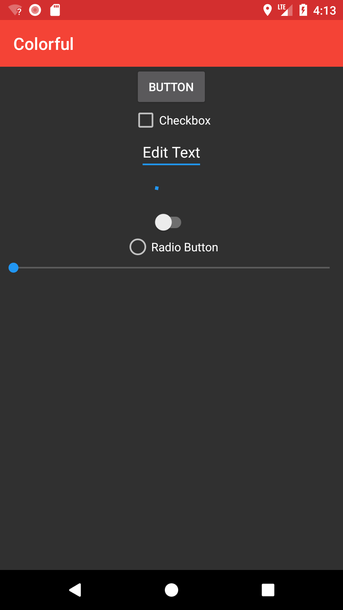
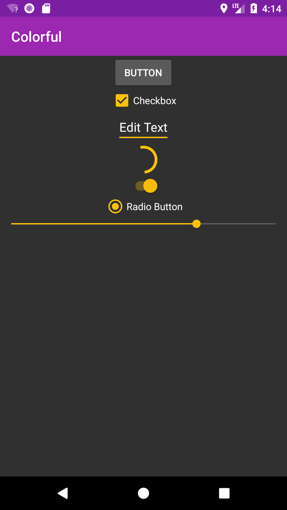
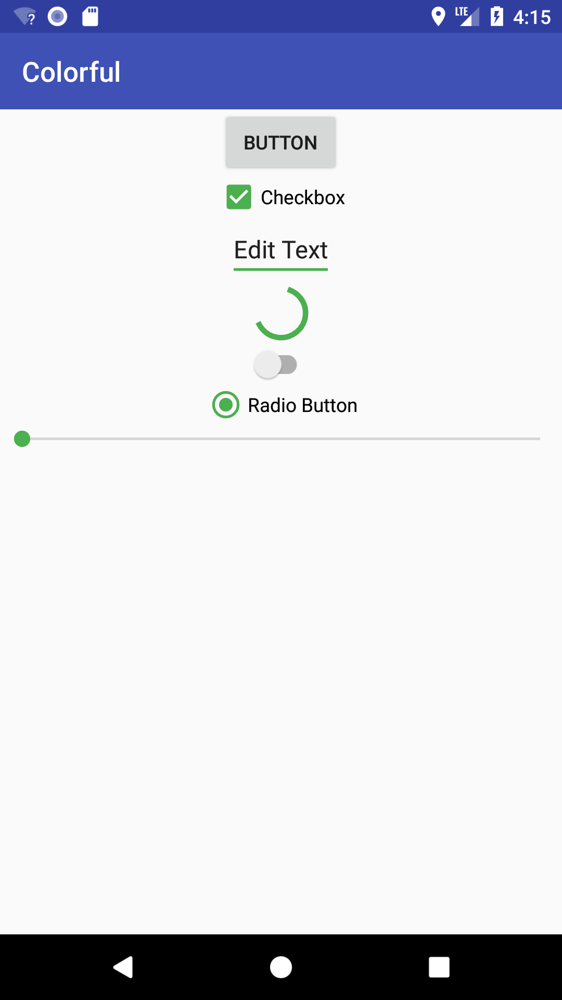

# Colorful
[](https://jitpack.io/#garretyoder/Colorful) [](https://travis-ci.org/garretyoder/Colorful)


Colorful is a dynamic theme library allowing you to change your apps' color schemes easily.
*Colorful v2 is here! v2 has been rewritten from the ground up in Kotlin to be lighter, faster, and more feature-packed*

## License

Colorful is licensed under the Apache 2.0 License

Copyright 2018 Garret Yoder

|                                    |                                    |                                    |
| ---------------------------------- | ---------------------------------- | ---------------------------------- |
|   |   |   |

## Installation
Add jitpack to your maven sources
```groovy
allprojects {
    repositories {
        ...
        maven { url "https://jitpack.io" }
    }
}
```
Add Colorful as a dependency to your `build.gradle`
```groovy
dependencies {
    compile 'com.github.garretyoder:Colorful:2.0'
}
```

## Usage

In your `Application` class, you must initialize Colorful and set the default theme colors.
```kotlin
class SampleApp:Application() {
    override fun onCreate() {
        super.onCreate()
        val defaults:Defaults = Defaults(
                primaryColor = ThemeColor.GREEN,
                accentColor = ThemeColor.BLUE,
                useDarkTheme = false,
                translucent = false)
        initColorful(this, defaults)
    }
}
```
Any `Activity` you wish to be automatically themed must extend from either `CActivity` or `CAppCompatActivity` if you wish to use AppCompat
```kotlin
class MainActivity : CActivity()
```
```kotlin
class MainActivity : CAppCompatActivity()
```
If you wish to use your own activity, you can manually apply Colorful's theme to any activity using `apply(activity:Activity)`
```kotlin
Colorful().apply(this, override = true, appcompat = false)
```
The `override` value will control whether Colorful overrides your activitie's existing base theme, or merely sets primary and accent colors. **Note**: dark/light themeing will not work when override is disabled
The `appcompat` value will control which base theme Colorful will use, Appcompat or Material
You can set the colors at any time using the `edit()` method
```kotlin
        Colorful().edit()
                .setPrimaryColor(ThemeColor.RED)
                .setAccentColor(ThemeColor.BLUE)
                .setDarkTheme(true)
                .setTranslucent(true)
                .apply(context:Context)
```
You must call `apply(context:Context)` to save your changes

Colorful will handle saving and loading your theme preferences for you

## Custom styles

Colorful has beta support for combining your own styles with it's own. This is not yet guaranteed to work reliably. 
```kotlin
Colorful().edit()
                .setPrimaryColor(ThemeColor.RED)
                .setAccentColor(ThemeColor.BLUE)
                .setDarkTheme(true)
                .setTranslucent(true)
                .setCustomThemeOverride(R.style.AppTheme)
                .apply(this)
 ```
 The `setCustomThemeOverride` method will allow Colorful to mix a provided theme with it's own. If you wish to set specific theme items yourself, such as coloring all text orange, you can do this within a style file and then have Colorful merge it with it's own theme.
